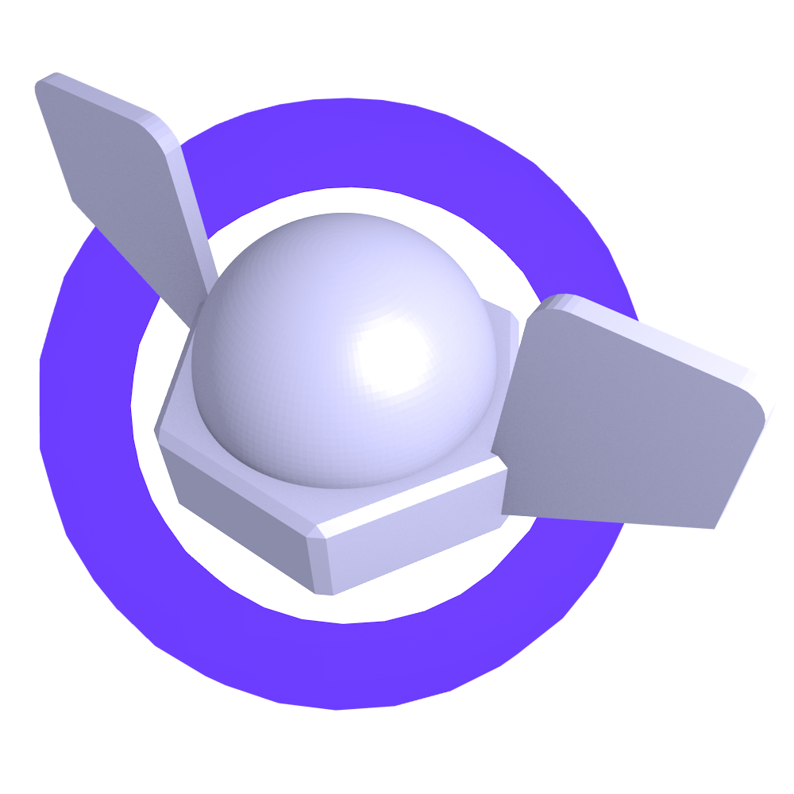

# Timeless

"Project Timeless" is a faithful remake of *Wingnuts: Temporal Navigator* in 3D using Blender and Godot. *Wingnuts: Temporal Navigator* is a 2006 Mac OS X game about a pilot fighting against Baron von Shtopwatch and his fleet of time-traveling planes. Travel around the wrapped map as you shoot down enemy planes, bomb ground installations, collect floating goodies, and destroy the boss plane. *Wingnuts* is similar to Time Pilot, except it is much more difficult and chaotic with large levels and missiles flying everywhere.
